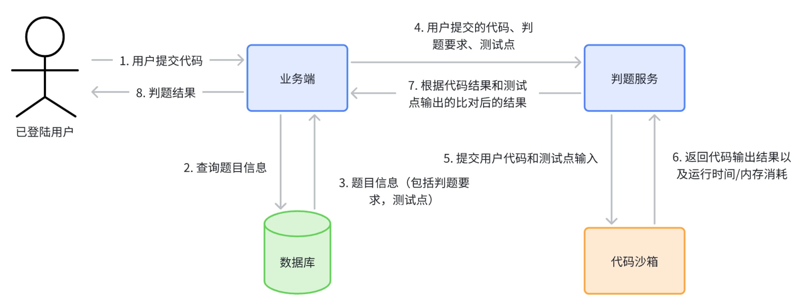
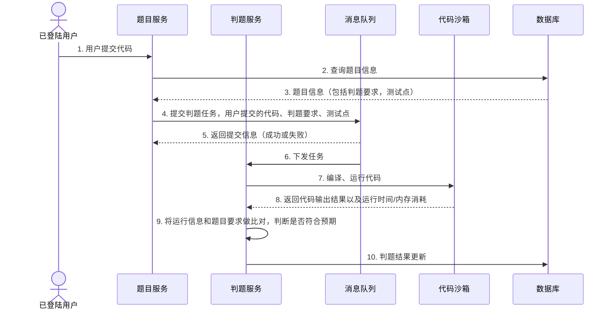

# EJudge

## 项目介绍
由于有教过小朋友学习信奥入门的知识，一直很好奇如何做一个 OnlineJudge，所以根据网上的参考资料自己做了一个试一试，采用的技术栈有 SpringBoot、Docker、Vue 3 等。

主要工作集中在后端部分，后端的功能模块分为：
- 用户模块：基础的用户登录注册
- 题目模块：用户可以浏览题目，管理员还可以创建/修改/删除题目
- 判题模块：主要负责用户的代码和预设的输出结果是否一致，并判断超时/超内存的问题。
- 代码沙箱：使用 Java 原生/Docker 实现的执行代码服务，输入用户的代码，给出运行的实际结果。

## 调研
常见的 OJ 实现：
- [HDU OJ](https://acm.hdu.edu.cn/)
- [HimitZH/HOJ: ⚡🔥Hcode Online Judge(HOJ)🔥⚡](https://github.com/HimitZH/HOJ)：SprinCloud + Vue
- [Luogu 洛谷](https://www.luogu.com.cn/)
- [LeetCode](https://leetcode.cn/)
- [LibreOJ](https://loj.ac/)
- [Vijos](https://vijos.org/)
- [HydroOJ](https://hydro.ac/)
- [QingdaoU/OnlineJudge](https://github.com/QingdaoU/OnlineJudge)
- [go-judge](https://github.com/criyle/go-judge)

## 核心业务流程
整个项目的核心业务在于，用户的代码如何执行，代码执行的结果如何进行评判？本项目中将上述的两个内容进行拆分，分为两个部分进行实现。
1. 判题服务：获取题目、预计的输入输出的结果，返回给主业务后端，判断用户答案是否正确
2. 代码沙箱，只负责运行代码，给出结果，不管结果是否正确

这样几个好处：
- 实现服务解耦，代码不会很杂糅。
- 代码沙箱只作为运行代码的，不仅可以把这个服务交付给判题，也可以把这个模块交付给网页在线执行代码的服务。
- 在后续，也可以使用更高性能的语言进行实现，比如 Go。

**难点**：
1. **代码沙箱（安全沙箱）**，如何实现安全的代码沙箱，
	- 需要对用户的代码进行隔离运行，保证系统安全；
	- 合理的资源分配：系统内存/cpu 的分配，限制占用资源
2. **任务调度**：服务器资源有限，用户需要排队，按照顺序取一次执行判题，而不是直接拒绝

## 核心业务流程

